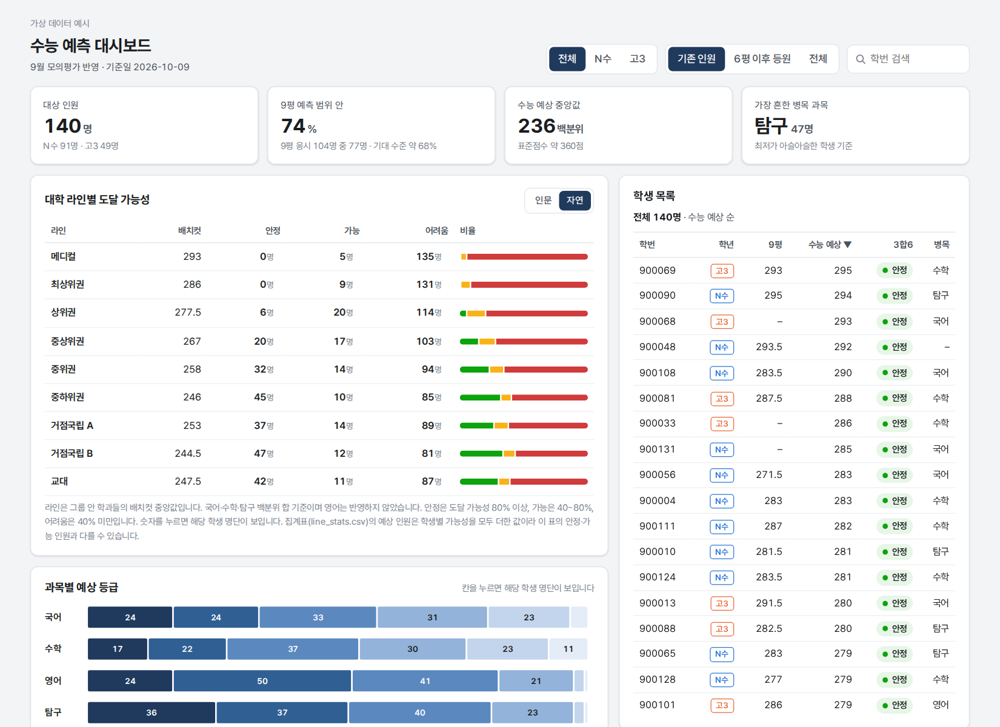
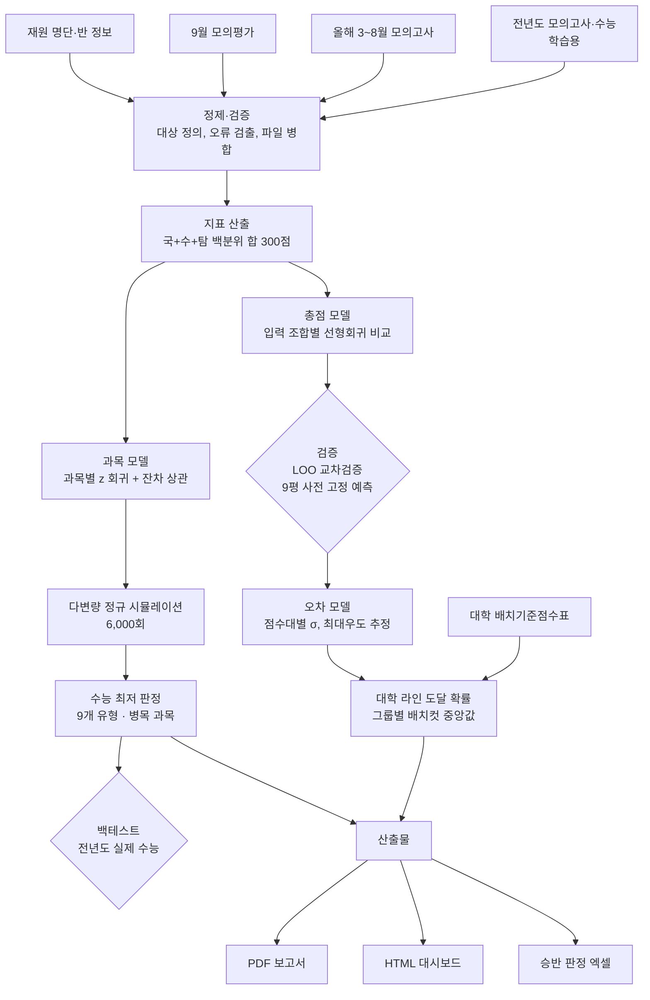
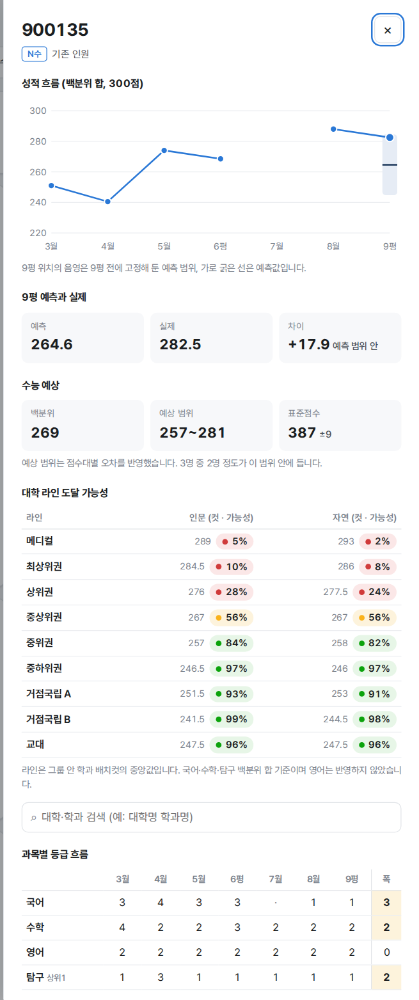

# 수능 성적 예측 및 대학 라인 도달 가능성 분석

N수·고3 재원생의 모의고사 성적으로 **수능 성적**, **대학 그룹 라인 도달 가능성**, **수능 최저 충족 가능성**을 예측하고, 운영진용 PDF 보고서와 담임용 HTML 대시보드로 배포한 분석 파이프라인입니다.

학습 표본이 작아서(전년도 수능 응시자 중 모의고사 기록이 있는 69~95명) 복잡한 모델 대신 **단순 선형 모델 + 엄격한 검증 + 불확실성의 확률 표현**에 집중했습니다.

> 학생 개인정보가 포함된 원본 데이터와 학생별 결과는 저장소에 포함하지 않습니다. 대신 같은 형식의 **가상 학생 데이터**로 전체 파이프라인을 처음부터 끝까지 돌려볼 수 있습니다.



## 빠른 실행

```bash
pip install -r requirements.txt
python scripts/run_pipeline.py          # data/sample 의 가상 데이터로 실행 → outputs/
python -m pytest                        # 단위 테스트와 전체 실행 테스트
```

`outputs/dashboard.html`을 브라우저로 열면 위와 같은 화면이 나옵니다. 서버 없이 파일 하나로 동작합니다. 가상 데이터는 `python scripts/make_sample_data.py`로 다시 만들 수 있습니다.

---

## 핵심 결과

실제 데이터로 낸 결과입니다. 저장소의 가상 데이터로 돌리면 값은 다르게 나옵니다.

| 항목 | 결과 |
|---|---|
| 사전 고정 예측 검증 (9월 모의평가, n=90) | 예측 범위 안 73% (기대 수준 68%), 치우침 −0.3점 |
| 점수대별 오차 모델 도입 | 라인 도달 확률의 Brier 점수 0.090 → 0.083 |
| 수능 최저 판정 백테스트 (전년도) | 안정 판정의 98%, 경계 63%, 위험 12%가 실제 충족 |
| 데이터 검증 | 입력 오류 의심 10건 검출 (보정 6, 제외 2, 확인 요청 2) |

---

## 파이프라인



---

## 1. 데이터

| 데이터 | 내용 | 용도 |
|---|---|---|
| 전년도 모의고사·수능 | 3~11월 모의고사, 실제 수능 | 모델 학습, 백테스트 |
| 올해 모의고사 | 3~8월 (평가원 6평, 사설 실모 포함) | 예측 입력 |
| 9월 모의평가 | 과목별 표준점수·백분위·등급 | 예측 입력, 사전 예측 채점 |
| 재원 명단 | 학번, 학년, 등원·퇴원일, 반 | 대상 정의 |
| 배치기준점수표 | 대학·모집단위별 백분위 배치컷 (4,572행) | 대학 라인 정의 |

## 2. 전처리와 데이터 검증

- **대상 정의:** 기준일 재원 여부와 3~6월 모의고사 기록 여부로 기존 인원과 6평 이후 등원생을 나누고, 두 집단은 입력 시험이 다르므로 모델을 따로 적용했습니다.
- **지표 선택:** 표준점수는 해마다 난이도가 달라 연도 간 비교가 어렵기 때문에 백분위 합(국어 + 수학 + 탐구 2과목 평균, 300점)을 기준으로 삼았습니다.
- **입력 오류 검출 규칙**
  - 같은 시험, 같은 과목, 같은 표준점수인데 백분위나 등급이 다른 행을 찾습니다.
  - 과목 안에서 표준점수가 높은데 백분위가 낮은 역전을 찾습니다.
  - 근거가 명확하면 다수 값으로 보정하고, 판단이 어려우면 해당 지표에서 제외하거나 원본 확인을 요청했습니다.
- **파일 버전 병합:** 성적 파일이 갱신되면 새 값을 우선하고, 새 파일에서 비어 있는 칸은 이전 값으로 채운 뒤 바뀐 행을 모두 보고했습니다.

## 3. 모델링

### 3-1. 총점 예측: 입력 조합 비교

모델은 `수능 백분위 합 = a + b × (모의고사 평균)` 하나로 고정하고, **어떤 시험을 입력으로 쓸지**를 LOO 교차검증으로 비교했습니다.

| 입력 | LOO RMSE |
|---|---|
| 3~6월 | 19.4 |
| **3~6월 + 9평 (기존 인원 채택)** | **19.9** |
| 3~8월 + 9평 | 20.7 |
| **보정 7·8월 + 9평 (6평 이후 등원생 채택)** | **22.6** |
| 9평 단독 (같은 학생 기준 3~6월 + 9평은 21.3) | 26.3 |
| 2차식 (3~6월 + 9평) | 20.1 |

- 3~6월만 쓸 때와 9평을 더할 때의 차이(0.5점)는 우연 범위라, 가장 최근 평가원 시험인 9평을 포함했습니다.
- 곡선(2차식)은 오차를 줄이지 못해 선형을 유지했습니다.

### 3-2. 사전 고정 예측으로 시간 외 검증

9월 모의평가 전에 예측을 파일로 고정하고, 성적 발표 후 채점했습니다.

- 사설 실모(7·8월) 점수를 그대로 쓰면 9평을 **평균 8.5점 높게** 예측했습니다. 사설 실모 백분위가 부풀려져 있다는 가설이 확인됐습니다.
- 학생별 3~6월 평균을 기준점으로 7·8월을 연도 간 보정하면 치우침은 사라졌지만, 3~6월만 쓴 것보다 나아지지 않았습니다(RMSE 18.5 대 18.2). 그래서 기존 인원 모델에서는 7·8월을 뺐습니다.
- 최종 채점(n=90): 예측 범위 안 73%, RMSE 17.7, 치우침 −0.3점입니다. 대시보드의 "9평 예측 범위 안" 수치도 이 사전 고정 예측(기존 인원은 보정 7·8월 포함)으로 계산합니다.

### 3-3. 오차 모델: 점수대별 σ

모든 학생에게 같은 오차(±20)를 쓰면 상위권에는 지나치게 넓습니다. 그래서 LOO 잔차로 점수대별 오차 곡선을 최대우도 추정했습니다.

```
σ(p) = exp(θ0 + θ1 · (p − 240) / 10),   12 ≤ σ ≤ 40
```

| 예측 점수 | 250 이상 | 230 | 220 | 200 |
|---|---|---|---|---|
| σ | ±12~14 | ±20 | ±24 | ±34 |

- **최소값(floor):** 0, 8, 10, 12, 14를 LOO Brier 점수로 비교했습니다. 차이가 거의 없어서(0.0789 ~ 0.0796), 올해 9평에서 상위권 오차가 더 컸던 점을 반영해 보수적으로 12를 골랐습니다.
- **최대값(cap):** 아주 낮은 점수에서 σ가 140까지 커져 비현실적인 확률이 나오는 것을 막기 위해 40으로 제한했습니다.

### 3-4. 대학 라인 도달 확률

- 배치기준점수표에서 국어·수학·탐구를 모두 반영하는 모집단위만 골라, 11개 대학 그룹의 계열별 배치컷 중앙값을 라인으로 정의했습니다. 실기, 지역인재 등 제한 전형은 라인 계산에서 뺐습니다.
- 학생별 도달 확률은 `P = 1 − Φ((컷 − 예측) / σ(예측))`로 계산했습니다.
- 탐구 1과목만 반영하는 학과는 학생의 두 탐구 백분위 차이의 절반을 더해 계산합니다. 작년 자료로 점검하면 이 방식의 오차(RMSE 19.5)는 기본 지표의 오차(19.9)와 비슷했습니다.
- 집단 예상 인원은 학생별 확률의 합으로 내고, 90% 범위는 시뮬레이션으로 구했습니다.

### 3-5. 과목별 등급과 수능 최저

- 국어, 수학, 탐구는 백분위를 z 값으로 바꾸고, 영어는 등급 그대로 과목별 선형회귀를 했습니다.
- 과목별 잔차 표준편차와 잔차 상관행렬로 다변량 정규분포를 만들어 6,000회 시뮬레이션했습니다.
- 시뮬레이션마다 등급을 매기고(탐구는 두 과목 중 상위 1과목), 9개 최저 유형(2합5~4합8)의 충족 비율을 확률로 썼습니다.

### 3-6. 병목 과목 정의 비교

"최저를 놓친다면 어느 과목 때문인가"를 학생마다 하나씩 고르기 위해 세 가지 정의를 비교했습니다 (경계 학생 109명 기준).

| 정의 | 영어 | 탐구 | 수학 | 국어 | 판단 |
|---|---|---|---|---|---|
| 한 등급 하락 시 충족 확률 감소폭 | 50 | 30 | 15 | 14 | 과목별 변동성을 무시함 |
| 과목별 1σ 하락 시 감소폭 | 5 | 79 | 13 | 12 | 거의 전원이 탐구로 나와 변별력이 낮음 |
| **실패 시뮬레이션의 원인 과목** | **10** | **52** | **20** | **27** | **채택** |

채택한 정의는 최저를 놓친 시뮬레이션마다, 해당 과목만 평소(중앙값) 등급이었다면 충족했을 경우를 셉니다. 여유가 적은 과목과 변동이 큰 과목이 함께 반영됩니다.

## 4. 설계 선택 요약

| 항목 | 비교한 후보 | 선택 기준 | 선택 |
|---|---|---|---|
| 입력 시험 | 3~6월, +9평, +7·8월, 9평 단독 | LOO RMSE, 사전 예측 채점 | 3~6월 + 9평 |
| 모델 형태 | 선형, 2차식 | LOO RMSE | 선형 |
| 사설 실모 처리 | 원점수, 연도 간 보정, 제외 | 사전 예측 치우침·RMSE | 제외 (6평 이후 등원생은 보정 사용) |
| 오차 구조 | 단일 σ, 점수대별 σ | Brier, log loss | 점수대별 σ |
| σ 최소·최대 | floor 0~14, cap | Brier, 극단값 점검 | 12, 40 |
| 판정 구간 | 안정 80%, 경계 40% | 관례 + 백테스트 확인 | 80% / 40% |
| 병목 정의 | 3가지 | 해석 가능성, 변별력 | 실패 원인 과목 |

표본이 작기 때문에 그리드 서치처럼 많은 조합을 탐색하지 않고, 근거가 분명한 소수의 선택지만 검증으로 비교했습니다. 자유도를 늘리면 과적합 위험이 커지기 때문입니다.

## 5. 인사이트

1. **사설 실모 백분위는 부풀려져 있습니다.** 평가원 시험과 3~6월 모의고사가 더 믿을 만한 입력이었습니다.
2. **개인 오차의 대부분은 학생 본인의 시험별 기복입니다.** 같은 학생도 시험마다 ±16점 정도 흔들려서 이론상 한계가 약 ±17점입니다. 모델 개선 여지는 1~2점이므로, 점수 하나보다 확률로 표현하는 것이 실무에 맞습니다.
3. **오차는 상위권일수록 작습니다.** 상위권은 ±12~14점, 220점 미만은 ±24점 이상입니다.
4. **수능에서 유독 무너지는 경향은 없었습니다.** 수능이 6평·9평보다 모두 낮았던 학생은 27%로, 우연 수준(33%)보다 낮았습니다. 6·9평 평균 270점 이상 최상위권은 81%가 평균 ±10점 안에 들었습니다.
5. **영어는 등급 변동이 작아 최저 실패의 원인이 되는 경우가 적고, 탐구가 가장 자주 원인이 됩니다.**
6. **작은 표본은 착시를 만듭니다.** 고3이 예측보다 13점 높다는 신호는 9명 기준이었고, 20명으로 늘자 4점으로 줄었습니다.

## 6. 한계와 다음 단계

- 학습 데이터가 1개 연도, 69~95명으로 작습니다. 수능 결과가 나오면 올해 자료를 더해 다시 학습할 예정입니다.
- 전년도 자료에 학년 구분이 없어 고3의 성장 효과를 따로 반영하지 못했습니다.
- 대학 라인 계산에는 영어가 빠져 있습니다.
- 전년도 점검에서 최상위 라인(SKY 등) 도달 인원을 실제보다 적게 추정하는 경향이 있었습니다.
- 과목별 등급 분포의 탐구 상위 1과목 계산은 두 과목 독립 가정을 씁니다.

## 7. 산출물

- **HTML 대시보드:** 서버 없이 파일 하나로 열리는 단일 HTML 파일입니다. 학년·구분 필터, 라인·최저·병목 패널에서 클릭하면 해당 학생 목록을 보여 주고, 학생 카드에서 성적 흐름, 수능 예상 범위, 라인별 가능성, 학과 검색, 최저 판정을 볼 수 있습니다.
- **PDF 보고서:** 결론 요약, 대학 라인별 예상 인원, 수능 최저 점검, 유의 사항, 학생별 최저 경계 목록, 기준.
- **승반 판정 엑셀:** 9평 등급 합으로 반 배정 기준 충족 여부를 판정하며, 엑셀 2016 호환 수식을 씁니다.

PDF 보고서와 승반 판정 엑셀은 내부 양식에 맞춘 문서라 저장소에는 넣지 않았습니다. 보고서에 들어간 수치는 모두 `outputs/`의 집계표(`line_stats.csv`, `minimum_table.csv` 등)와 같은 계산에서 나옵니다.



## 8. 저장소 구조

```
config/
  sample.json             가상 데이터 실행 설정 (경로, 기준일, σ floor·cap, 판정 구간, 대시보드 제목)
  groups.sample.json      가상 대학 그룹
  groups.kr.json          실제 분석에 쓴 11개 대학 그룹 정의
data/
  README.md               입력 파일 형식
  sample/                 가상 데이터 (scripts/make_sample_data.py 로 생성)
scripts/
  make_sample_data.py     가상 데이터 생성
  run_pipeline.py         전체 실행
src/suneung/
  schema.py               열 이름, 시험 코드, 입력 조합 같은 공통 상수
  io.py                   파일 읽기, 시험명·과목명 표준화
  clean.py                입력 오류 검출(같은 표준점수 불일치, 역전), 수동 보정, 9평 파일 버전 병합
  metrics.py              백분위 합, 표준점수 합, z 변환, 등급 변환
  total_model.py          입력 조합 비교(LOO), 사설 실모 연도 간 보정, 9평 사전 예측 점검, 총점 모델
  error_model.py          점수대별 σ 최대우도 추정, floor 비교(Brier, log loss), 보정도
  lines.py                대학 그룹 배정, 라인 컷, 예상 인원과 90% 범위, 전년도 재현 점검
  subject_model.py        과목 모델, 다변량 정규 시뮬레이션, 최저 판정, 병목 정의 3가지, 백테스트
  dashboard.py            단일 파일 HTML 생성 (선택: Pretendard 글꼴 내장)
  pipeline.py             위 단계를 순서대로 실행
templates/dashboard.html  대시보드 템플릿
tests/                    단위 테스트, 가상 데이터 전체 실행 테스트
```

### 실행 단계와 결과 파일

| 단계 | 모듈 | 결과 파일 (`outputs/`) |
|---|---|---|
| 1. 로드, 9평 파일 병합 | `io`, `clean.merge_versions` | `sept_merge_log.csv` |
| 2. 정제 | `clean` | `data_issues.csv` |
| 3. 지표, 대상 정의 | `metrics` | |
| 4. 총점 모델 | `total_model` | `model_comparison.csv`, `sept_check.csv` |
| 5. 오차 모델 | `error_model` | `sigma_floor_eval.csv`, `sigma_calibration.csv`, `sigma_params.json` |
| 6~7. 수능 예상, 대학 라인 | `total_model`, `lines` | `students.csv`, `line_cuts.csv`, `line_stats.csv`, `line_backcheck.csv` |
| 8. 과목 모델, 수능 최저 | `subject_model` | `minimum_backtest.csv`, `minimum_table.csv`, `bottleneck_compare.csv` |
| 9. 대시보드 | `dashboard` | `dashboard.html`, `dashboard_data.json` |
| 10. 요약 | `pipeline` | `summary.md` |

### 가상 데이터에서 재현되는 경향

가상 데이터는 실제 데이터에서 확인한 현상(사설 실모 점수 부풀림, 하위권일수록 큰 수능 변동, 영어의 작은 등급 변동)을 넣어 만들었습니다. 그래서 숫자는 달라도 같은 방향의 결과가 나옵니다 (`--seed 2` 기준).

| 점검 | 가상 데이터 결과 |
|---|---|
| 9평 사전 예측 치우침 (실제 − 예측) | 사설 실모 원점수 −7.3점, 연도 간 보정 +0.2점 |
| 라인 도달 확률 Brier (M1) | 단일 σ 0.078 → 점수대별 σ 0.066~0.069 |
| 수능 최저 백테스트 | 안정 98%, 경계 60%, 위험 10% 충족 |
| 병목 정의 비교 | 한 등급 하락 기준은 영어가 1위, 채택한 정의는 탐구가 1위 |
| 일부러 넣은 입력 오류 5건 | 모두 검출 (보정 3, 수동 보정 1, 확인 필요 1) |

### 실제 데이터로 실행하기

1. 성적, 명단, 배치표를 `data/README.md` 형식으로 준비해 저장소 밖으로 나가지 않는 폴더(예: `data/private/`)에 둡니다.
2. `config/sample.json`을 복사해 `config/real.private.json`을 만들고 경로, 기준일, 그룹 파일(`config/groups.kr.json`)을 바꿉니다. 이 이름은 `.gitignore`에 들어 있습니다.
3. `python scripts/run_pipeline.py --config config/real.private.json --out outputs/real`

대시보드에 Pretendard 글꼴을 넣으려면 `pip install fonttools[woff]` 후 설정의 `dashboard.font_dir`에 Pretendard OTF 폴더를 적습니다. 비워 두면 맑은 고딕 같은 시스템 글꼴로 표시됩니다.

## 기술 스택

- **분석:** Python, pandas, NumPy, SciPy
- **문서:** HTML/CSS → PDF (Playwright Chromium), openpyxl (내부 보고서용, 저장소 미포함)
- **대시보드:** 단일 파일 HTML, vanilla JavaScript, SVG
- **테스트:** pytest
