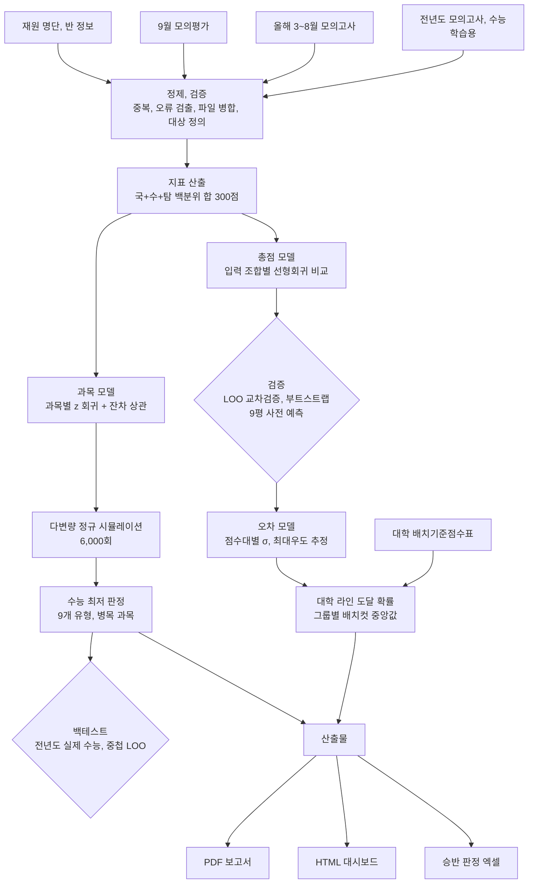

# 수능 성적 예측 및 대학 라인 도달 가능성 분석

[](https://github.com/ho66220-boop/CSAT-Outcome-Forecaster/actions/workflows/tests.yml)

N수, 고3 재원생의 모의고사 성적으로 **수능 성적**, **대학 그룹 라인 도달 가능성**, **수능 최저 충족 가능성**을 예측하고 운영진용 PDF 보고서와 담임용 HTML 대시보드로 배포한 분석 파이프라인입니다.

학습 표본이 작아서(전년도 수능 응시자 중 모의고사 기록이 있는 69\~95명) 복잡한 모델 대신 **단순 선형 모델 + 엄격한 검증 + 불확실성의 확률 표현**에 집중했습니다.

> 학생 개인정보가 포함된 원본 데이터와 학생별 결과는 저장소에 포함하지 않습니다. 대신 같은 형식의 **가상 학생 데이터**로 전체 파이프라인을 처음부터 끝까지 돌려볼 수 있습니다.


## 빠른 실행

```bash
pip install -r requirements.txt
python scripts/run_pipeline.py          # data/sample 의 가상 데이터로 실행 → outputs/
python -m pytest                        # 단위 테스트와 전체 실행 테스트
```

`outputs/dashboard.html`을 브라우저로 열면 위와 같은 화면이 나옵니다. 서버 없이 파일 하나로 동작합니다. 가상 데이터는 `python scripts/make_sample_data.py`로 다시 만들 수 있습니다.

---

## 핵심 결과

실제 데이터로 낸 결과입니다. 검증 수치는 이 저장소의 코드로 실제 데이터에서 다시 계산한 값이고, 가상 데이터로 돌리면 값은 다르게 나옵니다.

| 항목 | 결과 | 담임 입장에서의 의미 |
|---|---|---|
| 9평 사전 예측 채점 (기존 인원 90명) | 예측 범위 안 73% (95% 구간 63\~81%, 기대 수준 68%), 치우침 −0.3점 | 예측 범위가 실제 오차 크기에 맞게 잡혀 있습니다. 4명 중 1명은 범위를 벗어난다는 전제로 상담합니다. |
| 점수대별 오차 모델 | 라인 도달 확률 Brier 0.085 → 0.079 (학생 69명 × 컷 7개) | 상위권은 좁게, 하위권은 넓게 범위를 잡아 라인 확률이 더 정확해집니다. |
| 수능 최저 판정 백테스트 (전년도 69명 × 9개 유형) | 안정 판정의 97%, 경계 64%, 위험 12%가 실제 충족 | "안정"은 거의 충족하고 "위험"도 10명 중 1명은 충족합니다. |
| 데이터 검증 | 입력 오류 의심 10건 검출 (보정 6, 제외 2, 확인 요청 2) | 잘못 입력된 성적 때문에 예측이 틀어지는 일을 막습니다. |

## 실제 활용

- 대시보드는 고3 담임 3명과 N수 담임 5명이 함께 씁니다. 학생에게 직접 보여 주지 않고 상담할 때 참고 자료로 씁니다.
- 수능 최저 충족이 경계인 학생은 정기 상담에서 다루기로 했습니다.
- 전에는 이런 자료가 없어서 모의고사가 끝날 때마다 담임이 성적을 보고 감으로 위험 학생을 골랐습니다. 지금은 학번 검색 한 번으로 예상 범위, 라인별 가능성, 최저 판정을 같이 봅니다.
- 상담 준비 시간이 얼마나 줄었는지는 아직 측정하지 않았습니다.

---

## 파이프라인



---

## 1. 데이터

| 데이터 | 내용 | 용도 |
|---|---|---|
| 전년도 모의고사, 수능 | 3\~11월 모의고사, 실제 수능 | 모델 학습, 백테스트 |
| 올해 모의고사 | 3\~5월 사설 모의고사, 6평, 7월과 8월 사설 실모 (3\~5월과 출제처가 다름) | 예측 입력 |
| 9월 모의평가 | 과목별 표준점수, 백분위, 등급 | 예측 입력, 사전 예측 채점 |
| 재원 명단 | 학번, 학년, 등원일, 퇴원일, 반 | 대상 정의 |
| 배치기준점수표 | 대학, 모집단위별 백분위 배치컷 (4,572행) | 대학 라인 정의 |

## 2. 전처리와 데이터 검증

- **대상 정의:** 기준일 재원 여부와 3\~6월 모의고사 기록 여부로 기존 인원과 6평 이후 등원생을 나누고 두 집단은 입력 시험이 다르므로 모델을 따로 적용했습니다. 재원 중인데 4과목을 모두 본 시험이 없어 예측하지 못한 학생은 사유와 함께 따로 남깁니다(`excluded_students.csv`).
- **지표 선택:** 표준점수는 해마다 난이도가 달라 연도 간 비교가 어렵기 때문에 백분위 합(국어 + 수학 + 탐구 2과목 평균, 300점 만점)을 기준으로 삼았습니다.
- **중복 행:** 같은 학생의 같은 시험이 여러 행이면 값이 겹치지 않을 때만 합치고, 같은 칸의 값이 서로 다르면 그 시험 기록을 빼고 확인을 요청합니다.
- **입력 오류 검출 규칙**
  - 같은 시험, 같은 과목, 같은 표준점수인데 백분위나 등급이 다른 행을 찾습니다. 확실한 다수 값이 있으면 그 값으로 보정합니다. 다수가 없으면 앞뒤 표준점수와 순서가 맞는 값이 하나뿐일 때만 그 값으로 보정합니다.
  - 과목 안에서 표준점수가 높은데 백분위가 낮은 역전을 찾습니다.
  - 근거로 보정할 수 없는 값은 원본 확인을 요청하고 확인 전까지 해당 지표 계산에서 뺍니다. 원본을 확인한 값은 수동 보정 목록(`fixes.csv`)으로 반영합니다.
- **파일 버전 병합:** 성적 파일이 갱신되면 새 값을 우선하고 새 파일에서 비어 있는 칸은 이전 값으로 채운 뒤 바뀐 칸을 모두 기록합니다.

## 3. 모델링

### 3-1. 총점 예측: 입력 조합 비교

모델은 `수능 백분위 합 = a + b × (모의고사 평균)` 하나로 고정하고 **어떤 시험을 입력으로 쓸지**를 LOO 교차검증으로 비교했습니다. 기준선은 회귀 없이 시험 평균을 그대로 예측값으로 쓴 경우입니다.

| 입력 | 학생 | LOO RMSE |
|---|---|---|
| 3\~6월 | 69 | 19.4 |
| **3\~6월 + 9평 (기존 인원 채택)** | 69 | **19.9** |
| 3\~8월 + 9평 | 69 | 20.7 |
| 2차식 (3\~6월 + 9평) | 69 | 20.1 |
| 기준선: 3\~6월 + 9평 평균 그대로 | 69 | 19.8 |
| **7, 8월 + 9평 (6평 이후 등원생 채택)** | 95 | **22.6** |
| 9평 단독 (같은 학생 기준 3\~6월 + 9평은 21.3) | 46 | 26.3 |

- 3\~6월만 쓸 때와 9평을 더할 때의 차이는 0.4점이고 학생 단위 부트스트랩 95% 구간이 −1.0\~+1.8점이라 우연 범위입니다. 9평을 넣은 것은 가장 최근 평가원 시험이라 수능과 가장 비슷하다는 판단 때문입니다. 전년도 자료에서는 9평 비중을 높일수록 오차가 커졌기 때문에(가중치 0이면 19.4, 1이면 23.7) 자료로 이득이 확인된 선택은 아닙니다. 올해 수능 결과로 다시 확인할 예정입니다.
- 회귀는 시험 평균을 그대로 쓰는 것보다 점수 예측을 낫게 하지 못했습니다(차이 +0.1점, 95% 구간 −1.3\~+1.6). 점수 하나는 평균으로도 충분하고, 이 프로젝트에서 모델이 하는 일은 그 점수에 오차와 확률을 붙이는 것입니다.
- 곡선(2차식)은 오차를 줄이지 못해 선형을 유지했습니다.
- 7, 8월 + 9평 모델(M2)은 7, 8월이나 9평 기록이 있는 전년도 학생 모두로 학습하고 6평 이후 등원생에게 적용합니다. 그래서 다른 행과 학생 집단이 다릅니다.

### 3-2. 사전 예측으로 시간 외 검증

9월 모의평가 전에 전년도 자료만으로 만든 모델로 9평 예측을 파일로 만들어 두고 성적 발표 후 같은 학생 90명으로 채점했습니다. 이 파일은 저장소를 공개하기 전에 만든 내부 파일이라 저장소만으로 작성 시점을 증명할 수는 없습니다.

- 7, 8월 사설 실모 점수를 그대로 쓰면 9평을 **평균 8.7점 높게** 예측했습니다(RMSE 20.4). 학생별 3\~6월 평균을 기준점으로 7, 8월을 연도 간 보정하면 이 치우침이 사라졌습니다. 7, 8월 백분위가 높게 나온 원인이 출제처인지 집단 차이인지는 분리하지 못했습니다.
- 보정해도 3\~6월만 쓴 예측보다 나아지지는 않았습니다(RMSE 17.7 대 17.4). 그래서 기존 인원의 수능 모델에서는 7, 8월을 뺐습니다.
- 채점 결과(보정 예측, 90명): 예측 범위 안 73% (95% 구간 63\~81%), RMSE 17.7, 치우침 −0.3점입니다. 기대 수준(68%)과 비슷하다는 뜻이지 그보다 낫다는 뜻은 아닙니다. 6평 이후 등원생 28명은 범위 안 89%, 치우침 +5.1점이었습니다.
- 9평 결과는 이후 수능 모델의 입력 선택과 σ 최소값을 정하는 데도 썼습니다. 그래서 9평 채점은 9평 예측의 검증이고 최종 수능 예측의 검증은 아닙니다.
- 수능 예측은 수능 전에 고정했습니다. 학생 정보가 담긴 예측 파일 대신 파일의 SHA-256 해시만 [`preregistration/`](preregistration/)에 커밋해 두고 수능 성적 발표 후 채점합니다.
- 저장소의 `sept_check.csv`는 같은 절차를 코드로 다시 계산한 것입니다. 9평 시점 재원생을 대상으로 하고, 전년도 자료로만 학습해 9평 이전 시험에만 적용합니다.

### 3-3. 오차 모델: 점수대별 σ

모든 학생에게 같은 오차(±20)를 쓰면 상위권에는 지나치게 넓습니다. 그래서 LOO 잔차로 점수대별 오차 곡선을 최대우도 추정했습니다.

```
σ(p) = exp(θ0 + θ1 · (p − 240) / 10),   12 ≤ σ ≤ 40
```

| 예측 점수 | 250 이상 | 230 | 220 | 200 |
|---|---|---|---|---|
| σ | ±12\~14 | ±20 | ±24 | ±34 |

- **평가 방식:** 학생마다 그 학생을 완전히 뺀 나머지로 회귀선과 σ 곡선을 다시 맞추고(중첩 LOO) 220, 240, 250, 260, 270, 280, 290점 7개 컷의 도달 확률을 실제와 비교했습니다. 69명 × 7개 컷 = 483건입니다.
- **결과:** 단일 σ는 Brier 0.085, 점수대별 σ는 0.078\~0.079입니다.
- **최소값(floor):** 0, 8, 10, 12, 14의 차이가 거의 없어서(0.0784\~0.0792) 올해 9평에서 상위권 오차가 더 컸던 점을 반영해 보수적으로 12를 골랐습니다.
- **최대값(cap):** 아주 낮은 점수에서 σ가 140까지 커져 비현실적인 확률이 나오는 것을 막기 위해 40으로 제한했습니다.

예측 확률과 실제 도달 비율(중첩 LOO, floor 12):

| 예측 확률 | 건수 | 평균 예측 | 실제 비율 |
|---|---|---|---|
| 0\~0.2 | 233 | 0.05 | 0.05 |
| 0.2\~0.4 | 51 | 0.30 | 0.31 |
| 0.4\~0.6 | 35 | 0.50 | 0.43 |
| 0.6\~0.8 | 35 | 0.70 | 0.71 |
| 0.8\~1.0 | 129 | 0.96 | 0.99 |

### 3-4. 대학 라인 도달 확률

- 배치기준점수표에서 국어, 수학, 탐구 2과목을 모두 반영하는 모집단위만 골라 11개 대학 그룹의 계열별 배치컷 중앙값을 라인으로 정의했습니다. 탐구 1과목 반영 학과의 컷은 상위 1과목 기준이라 높게 나오므로 라인 계산에서 빼고 학과 검색에서만 씁니다. 실기, 지역인재 등 제한 전형도 라인 계산에서 뺐습니다.
- 학생별 도달 확률은 `P = 1 − Φ((컷 − 예측) / σ(예측))`로 계산했습니다.
- 탐구 1과목만 반영하는 학과는 학생의 두 탐구 백분위 차이의 절반을 더해 계산합니다. 작년 자료로 점검하면 이 방식의 오차(RMSE 19.5)는 기본 지표의 오차(19.9)와 비슷했습니다.
- 집단 예상 인원은 학생별 확률의 합으로 내고 90% 범위는 시뮬레이션으로 구했습니다. 시뮬레이션은 학생 오차가 서로 독립이라고 가정합니다(6장 참고).

### 3-5. 과목별 등급과 수능 최저

- 국어, 수학, 탐구는 백분위를 z 값으로 바꾸고 영어는 등급 그대로 과목별 선형회귀를 했습니다.
- 탐구 입력은 입력 시험 중 가장 최근 시험의 두 과목 기록으로 만듭니다. 수능에서 과목을 바꾼 학생도 예측 시점에 알 수 있는 과목 기록만 씁니다.
- 과목별 잔차 표준편차와 잔차 상관행렬로 다변량 정규분포를 만들어 6,000회 시뮬레이션했습니다. 상관행렬은 양의 정부호가 되도록 보정합니다.
- 시뮬레이션마다 등급을 매기고(탐구는 두 과목 중 상위 1과목) 9개 최저 유형(2합5\~4합8)의 충족 비율을 확률로 썼습니다. 과목별 예상 등급 분포도 같은 시뮬레이션에서 셉니다.
- 판정은 국어, 수학, 영어, 탐구 중 좋은 n개를 고르는 일반 n합k 기준입니다. 수학 필수, 과탐 필수처럼 과목을 지정한 최저는 판정하지 않습니다.
- 백테스트(중첩 LOO)

| 판정 | 기존 인원 모델 (69명, 621건) | 6평 이후 등원 모델 (97명, 873건) |
|---|---|---|
| 안정 | 97% 충족 | 94% 충족 |
| 경계 | 64% 충족 | 70% 충족 |
| 위험 | 12% 충족 | 16% 충족 |

### 3-6. 병목 과목 정의 비교

"최저를 놓친다면 어느 과목 때문인가"를 학생마다 하나씩 고르기 위해 세 가지 정의를 비교했습니다 (2026년 10월 보고서 기준, 경계 학생 109명).

| 정의 | 영어 | 탐구 | 수학 | 국어 | 판단 |
|---|---|---|---|---|---|
| 한 등급 하락 시 충족 확률 감소폭 | 50 | 30 | 15 | 14 | 과목별 변동성을 무시함 |
| 과목별 1σ 하락 시 감소폭 | 5 | 79 | 13 | 12 | 거의 전원이 탐구로 나와 변별력이 낮음 |
| **실패 시뮬레이션의 원인 과목** | **10** | **52** | **20** | **27** | **채택** |

채택한 정의는 최저를 놓친 시뮬레이션마다 해당 과목만 평소(중앙값) 등급이었다면 충족했을 경우를 셉니다. 여유가 적은 과목과 변동이 큰 과목이 함께 반영됩니다.

## 4. 설계 선택 요약

| 항목 | 비교한 후보 | 선택 기준 | 선택 |
|---|---|---|---|
| 입력 시험 | 3\~6월 / 3\~6월 + 9평 / 3\~8월 + 9평 / 9평 단독 / 9평 가중치 | LOO RMSE와 부트스트랩 구간, 사전 예측 채점 | 3\~6월 + 9평 (차이는 우연 범위, 9평 포함은 판단) |
| 점수 예측 방식 | 선형 회귀, 2차식, 평균 그대로 | LOO RMSE | 선형 회귀 (점수 예측력은 평균과 같음) |
| 7, 8월 사설 실모 처리 | 원점수 / 연도 간 보정 / 제외 | 사전 예측 치우침, RMSE | 제외 (6평 이후 등원생은 보정 사용) |
| 오차 구조 | 단일 σ, 점수대별 σ | 중첩 LOO Brier, log loss | 점수대별 σ |
| σ 최소, 최대 | floor 0\~14, cap | 중첩 LOO Brier, 극단값 점검 | 12, 40 |
| 판정 구간 | 안정 80%, 경계 40% | 관례 + 백테스트 확인 | 80% / 40% |
| 병목 정의 | 3가지 | 해석 가능성, 변별력 | 실패 원인 과목 |

표본이 작기 때문에 그리드 서치처럼 많은 조합을 탐색하지 않고 근거가 분명한 소수의 선택지만 검증으로 비교했습니다. 자유도를 늘리면 과적합 위험이 커지기 때문입니다.

## 5. 인사이트

1. **7, 8월 사설 실모를 그대로 넣으면 예측이 높게 치우칩니다.** 9평을 평균 8.7점 높게 예측했고 3\~6월 평균을 기준으로 연도 간 보정하면 치우침이 사라졌습니다. 같은 사설인 3\~5월 모의고사와 6평만 쓴 예측의 치우침은 −1.1점이었습니다.
2. **점수 하나는 평균으로도 충분하고 모델의 몫은 불확실성입니다.** 회귀가 시험 평균보다 점수를 더 잘 맞히지는 못했습니다. 대신 점수대별 오차를 붙이자 라인 확률이 좋아졌습니다(Brier 0.085 → 0.079).
3. **오차는 상위권일수록 작습니다.** 상위권은 ±12\~14점, 220점 미만은 ±24점 이상입니다.
4. **같은 학생도 시험마다 크게 흔들립니다.** 한 학생의 시험별 백분위 합은 ±16점 정도 움직였습니다. 그래서 점수 하나보다 범위와 확률로 전달하는 쪽을 택했습니다. (실제 데이터 탐색 결과, 저장소 코드에는 없음)
5. **수능에서 유독 무너지는 경향은 보이지 않았습니다.** 수능이 6평과 9평보다 모두 낮았던 학생은 27%였습니다. 세 시험의 조건이 같다면 33%가 기대값이지만 시점과 난이도가 달라 정확한 비교 기준은 아닙니다. (실제 데이터 탐색 결과, 저장소 코드에는 없음)
6. **최저를 놓치는 원인은 탐구가 가장 많고 영어는 적습니다.** 영어는 등급 변동이 작아서 여유가 적어도 실패 원인이 되는 경우가 드뭅니다(3-6).
7. **작은 표본은 착시를 만듭니다.** 고3이 예측보다 13점 높다는 신호는 9명 기준이었고 20명으로 늘자 4점으로 줄었습니다. (실제 데이터 탐색 결과, 저장소 코드에는 없음)

## 6. 한계와 다음 단계

- 학습 데이터가 1개 연도의 69\~95명으로 작습니다. 수능 결과가 나오면 올해 자료를 더해 다시 학습하고 9평 포함 여부도 다시 확인할 예정입니다.
- 학습 자료는 수능 성적이 확인된 학생뿐입니다. 전년도에 수능 성적이 없는 학생도 많았고 이들의 3\~6월 평균이 약 14점 낮았습니다. 그래서 하위권 오차와 라인 비율이 낙관적으로 추정됐을 수 있습니다.
- 전년도 자료에 학년 구분이 없어 고3의 성장 효과를 따로 반영하지 못했습니다.
- 대학 라인 계산에는 영어가 빠져 있습니다.
- 전년도 점검에서 최상위 라인 도달 인원을 실제보다 적게 추정했습니다(SKY 자연 컷 기준으로 예상 인원이 실제의 절반을 조금 넘는 수준).
- 평균 모델은 등분산 회귀이고 오차 모델은 점수대별 σ라 두 가정이 다릅니다. σ로 가중한 회귀는 아직 비교하지 않았습니다.
- 집단 90% 범위는 실제보다 좁을 수 있습니다. 그해 수능 난이도처럼 모든 학생을 같은 방향으로 움직이는 요인이 있는데 시뮬레이션은 학생 오차를 서로 독립으로 뽑기 때문입니다. 1개 연도 자료로는 이 공통 이동의 크기를 추정할 수 없어 설정값(`sigma.common_sd`)으로 넣을 수 있게만 했습니다. 학생별 확률과 예상 인원은 그대로 두고 범위만 넓어지며 가상 데이터에서는 공통 이동 σ를 5점만 넣어도 범위가 2배 안팎으로 넓어졌습니다(`line_range_sensitivity.csv`). 연도 자료가 쌓이면 연도별 평균 잔차의 분산으로 추정할 수 있습니다.

## 7. 산출물

- **HTML 대시보드:** 서버 없이 파일 하나로 열리는 단일 HTML 파일입니다. 학년 필터와 구분 필터가 있고 라인, 최저, 병목 패널의 숫자를 누르면 해당 학생 목록이 나옵니다. 학생 카드에서는 성적 흐름, 수능 예상 범위, 라인별 가능성, 학과 검색, 최저 판정을 볼 수 있습니다.
- **PDF 보고서:** 결론 요약, 대학 라인별 예상 인원, 수능 최저 점검, 유의 사항, 학생별 최저 경계 목록, 기준.
- **승반 판정 엑셀:** 9평 등급 합으로 반 배정 기준 충족 여부를 판정하며 엑셀 2016 호환 수식을 씁니다.

PDF 보고서와 승반 판정 엑셀은 내부 양식에 맞춘 문서라 저장소에는 넣지 않았습니다. 실제 데이터로 돌린 `outputs/`의 대시보드와 JSON에는 학생별 성적과 예측이 들어 있으므로 내부에서만 다룹니다.


## 8. 저장소 구조

```
config/
  sample.json             가상 데이터 실행 설정 (경로, 기준일, 9평 날짜, σ floor와 cap, 공통 이동 σ, 판정 구간, 대시보드 제목)
  groups.sample.json      가상 대학 그룹
  groups.kr.json          실제 분석에 쓴 11개 대학 그룹 정의
data/
  README.md               입력 파일 형식
  sample/                 가상 데이터 (scripts/make_sample_data.py 로 생성)
preregistration/          수능 전에 고정한 예측 파일의 SHA-256 해시
scripts/
  make_sample_data.py     가상 데이터 생성
  run_pipeline.py         전체 실행
  freeze_predictions.py   예측 파일 해시 기록과 대조
src/suneung/
  schema.py               열 이름, 시험 코드, 입력 조합 같은 공통 상수
  io.py                   파일 읽기, 시험명과 과목명 표준화
  clean.py                중복 정리, 입력 오류 검출(같은 표준점수 불일치, 역전), 수동 보정, 9평 파일 버전 병합
  metrics.py              백분위 합, 표준점수 합, z 변환, 등급 변환
  total_model.py          입력 조합 비교(LOO, 부트스트랩), 9평 가중치 실험, 7, 8월 연도 간 보정, 9평 사전 예측 점검, 총점 모델
  error_model.py          점수대별 σ 최대우도 추정, 중첩 LOO, floor 비교(Brier, log loss), 보정도
  lines.py                대학 그룹 배정, 라인 컷, 예상 인원과 90% 범위, 전년도 재현 점검
  subject_model.py        과목 모델, 다변량 정규 시뮬레이션, 최저 판정, 병목 정의 3가지, 백테스트
  dashboard.py            단일 파일 HTML 생성 (선택: Pretendard 글꼴 내장)
  pipeline.py             위 단계를 순서대로 실행 (단계별 함수)
templates/dashboard.html  대시보드 템플릿
tests/                    단위 테스트, 누수 점검, 가상 데이터 전체 실행과 수치 고정 테스트
```

### 실행 단계와 결과 파일

| 단계 | 모듈 | 결과 파일 (`outputs/`) |
|---|---|---|
| 1. 로드, 중복 정리, 9평 파일 병합 | `io`, `clean` | `sept_merge_log.csv` |
| 2. 정제 | `clean` | `data_issues.csv` |
| 3. 지표, 대상 정의 | `metrics` | `excluded_students.csv` |
| 4. 총점 모델 | `total_model` | `model_comparison.csv`, `model_comparison_ci.csv`, `sept_weight_scan.csv`, `sept_check.csv` |
| 5. 오차 모델 | `error_model` | `sigma_floor_eval.csv`, `sigma_calibration.csv`, `sigma_params.json` |
| 6\~7. 수능 예상, 대학 라인 | `total_model`, `lines` | `students.csv`, `line_cuts.csv`, `line_stats.csv`, `line_range_sensitivity.csv`, `line_backcheck.csv` |
| 8. 과목 모델, 수능 최저 | `subject_model` | `minimum_backtest.csv`, `minimum_table.csv`, `bottleneck_compare.csv` |
| 9. 대시보드 | `dashboard` | `dashboard.html`, `dashboard_data.json` |
| 10. 요약 | `pipeline` | `summary.md` |

### 가상 데이터에서 재현되는 경향

가상 데이터는 실제 데이터에서 확인한 현상(7, 8월 사설 실모 점수 부풀림, 하위권일수록 큰 수능 변동, 영어의 작은 등급 변동)을 넣어 만들었습니다. 그래서 숫자는 달라도 같은 방향의 결과가 나옵니다 (`--seed 2` 기준). 아래 숫자는 `tests/test_pipeline.py`에서 고정해 두었습니다.

| 점검 | 가상 데이터 결과 |
|---|---|
| 9평 사전 예측 치우침 (실제 − 예측) | 7, 8월 원점수 −7.4점, 연도 간 보정 +0.1점 |
| 라인 도달 확률 Brier (M1, 중첩 LOO) | 단일 σ 0.078 → 점수대별 σ 0.066\~0.069 |
| 수능 최저 백테스트 (M1, 중첩 LOO) | 안정 98%, 경계 60%, 위험 10% 충족 |
| 병목 정의 비교 | 한 등급 하락 기준은 영어가 1위, 채택한 정의는 탐구가 1위 |
| 일부러 넣은 입력 오류 5건 | 수동 보정 없이 자동 검출로 모두 찾음 (보정 3, 확인 필요 2). 그중 1건은 원본 확인 후 수동 보정 |

### 실제 데이터로 실행하기

1. 성적, 명단, 배치표를 `data/README.md` 형식으로 준비해 저장소 밖으로 나가지 않는 폴더(예: `data/private/`)에 둡니다.
2. `config/sample.json`을 복사해 `config/real.private.json`을 만들고 경로, 기준일, 9평 날짜, 그룹 파일(`config/groups.kr.json`)을 바꿉니다. 이 이름은 `.gitignore`에 들어 있습니다.
3. `python scripts/run_pipeline.py --config config/real.private.json --out outputs/real`

대시보드에 Pretendard 글꼴을 넣으려면 `pip install fonttools[woff]` 후 설정의 `dashboard.font_dir`에 Pretendard OTF 폴더를 적습니다. 비워 두면 맑은 고딕 같은 시스템 글꼴로 표시됩니다.

## 기술 스택

- **분석:** Python, pandas, NumPy, SciPy
- **문서:** HTML/CSS → PDF (Playwright Chromium), openpyxl (내부 보고서용, 저장소 미포함)
- **대시보드:** 단일 파일 HTML, vanilla JavaScript, SVG
- **테스트:** pytest, GitHub Actions
